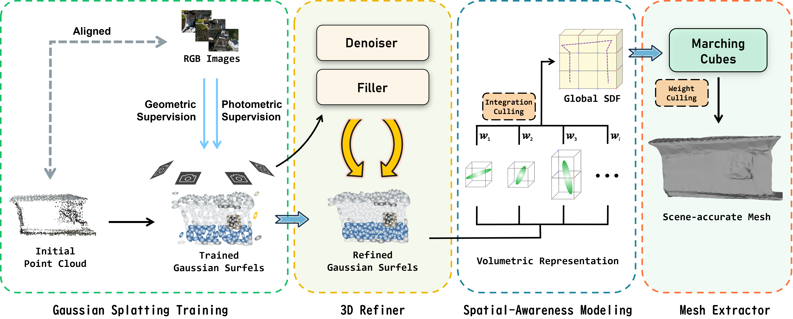

<br>
<p align="center">
<h1 align="center"><strong>GSSA: Gaussian Surfels with Spatial Awareness for Surface Reconstruction</strong></h1>

<div id="top" align="center">
<a href="https://donaldtrump-coder.github.io/GSSA/static/paper.pdf"></a>
<a href="https://www.mdpi.com/journal/remotesensing"></a>
<a href="https://donaldtrump-coder.github.io/GSSA/"></a>
<a href="https://github.com/DonaldTrump-coder/SDF-constructor"></a>


<a href="LICENSE.md"></a>
</div>
<br>

<p align="center">
  <a href="https://donaldtrump-coder.github.io/"><strong>Haojun Tang</strong></a>,
  <a href="https://github.com/zousiyuan3s/"><strong>Siyuan Zou</strong></a>,
  <a href="https://faculty.csu.edu.cn/panhongbo/zh_CN/index.htm"><strong>Hongbo Pan</strong></a>,
  <strong>Yixin Lu</strong>,
  <strong>Shun Zhou</strong>
</p>
  <p align="center">
    <em>School of Geoscience and Info-Physics, Central South University;<br>
    Key Laboratory of China-ASEAN Satellite Remote Sensing Applications, Ministry of Natural Resources;<br>
    Guangxi Beibu Gulf Investment Group Co., Ltd.</em>
  </p>
</p>

<p>
This repo is the official implementation of <strong>GSSA: Gaussian Surfels with Spatial Awareness for Surface Reconstruction</strong>, accepted at <em>Remote Sensing</em> in 2026. Here is the <a href = "https://donaldtrump-coder.github.io/GSSA/static/paper.pdf">PDF paper</a>. Star ⭐ us if you like it!
</p>

<p align="center">
  
</p>

## News
<ul>
  <li><strong>[2026.08]</strong> Paper is <a href="https://www.mdpi.com/2072-4292/18/15/2497">published</a>!</li>
  <li><strong>[2026.07]</strong> Code and <a href="https://donaldtrump-coder.github.io/GSSA/">Project Page</a> released!</li>
  <li><strong>[2026.07]</strong> Our core rasterization & TSDF engine released at <a href="https://github.com/DonaldTrump-coder/SDF-constructor">SDF-constructor</a>!</li>
  <li><strong>[2026.07]</strong> Paper accepted at <em>Remote Sensing</em>!</li>
</ul>

## Quick Start
### Environment
<strong>A. Clone repository</strong>

```bash
git clone https://github.com/DonaldTrump-coder/GSSA --recursive
cd GSSA
```

<strong>B. Create python environment</strong>

```bash
conda create -n gssa python=3.9
conda activate gssa
```

<strong>C. Install PyTorch</strong>
<ul><li>For CUDA 11.8</li></ul>

```bash
pip install torch==2.0.1 torchvision==0.15.2 torchaudio==2.0.2 --index-url https://download.pytorch.org/whl/cu118
or
pip install torch==2.0.1 torchvision==0.15.2 torchaudio==2.0.2 -f https://download.pytorch.org/whl/cu118 -i https://pypi.tuna.tsinghua.edu.cn/simple
```

<strong>D. Install requirements</strong>

```bash
pip install "numpy<2" --force-reinstall
pip install -r requirements.txt
pip install -r requirements/CityGS.txt
pip install -r requirements/common.txt
pip install pybind11
pip install torchmetrics==1.1.0
pip install submodules/simple-knn
pip install submodules/diff-trim-surfel-rasterization
pip install submodules/diff-gaussian-rasterization
pip install submodules/sdf-constructor
```

<strong>E. Prepare for depth-estimation model</strong>

```bash
git clone https://github.com/DepthAnything/Depth-Anything-V2 utils/Depth-Anything-V2
mkdir utils/Depth-Anything-V2/checkpoints
wget -O utils/Depth-Anything-V2/checkpoints/depth_anything_v2_vitl.pth "https://huggingface.co/depth-anything/Depth-Anything-V2-Large/resolve/main/depth_anything_v2_vitl.pth?download=true"
```

### Data
Organize your input data as follows:
```
data/$SCENE_NAME/
├── images/          # RGB images
│   ├── 0001.jpg
│   ├── 0002.jpg
│   └── ...
└── sparse/          # COLMAP sparse reconstruction results
    └── 0/
        ├── cameras.bin
        ├── images.bin
        └── points3D.bin
```
Example data can be found [here](https://repo-sam.inria.fr/fungraph/3d-gaussian-splatting/datasets/input/tandt_db.zip).

### Running
<strong>A. Data Preprocessing</strong>

```bash
python utils/image_downsample.py data/your_scene/images --factor $DOWNSAMPLE_RATIO
python utils/estimate_dataset_depths.py data/your_scene -d $DOWNSAMPLE_RATIO
```
`$DOWNSAMPLE_RATIO` (>1) is also set in the YAML of config.

<strong>B. Gaussian Training</strong>

```bash
python main.py fit \
        --config configs/$SCENE_NAME.yaml \
        -n $SCENE_NAME
```

<strong>C. Surface Extraction</strong>

```bash
python utils/gs2d_mesh_extraction.py \
        outputs/$SCENE_NAME \
        --voxel_size $VOXEL_SIZE
```

## Acknowledgements
This project benefits from [2DGS](https://surfsplatting.github.io/), [CityGaussianV2](https://dekuliutesla.github.io/CityGaussianV2/). Thanks for their great work!

## License
This project is licensed under [CC BY-NC-SA 4.0](https://creativecommons.org/licenses/by-nc-sa/4.0/). Commercial use requires prior consent. See [LICENSE](LICENSE.md) details.

## Citation
If you find our work helpful, please cite:
```bibtex
@article{tang2026gssa,
    title = {GSSA: Gaussian Surfels with Spatial Awareness for Surface Reconstruction},
    author = {Tang, Haojun and Zou, Siyuan and Pan, Hongbo and Lu, Yixin and Zhou, Shun},
    journal = {Remote Sensing},
    year = {2026},
    volume = {18},
    number = {15},
    article-number = {2497},
    doi = {10.3390/rs18152497},
    url = {https://www.mdpi.com/2072-4292/18/15/2497},
    issn = {2072-4292}
}
```